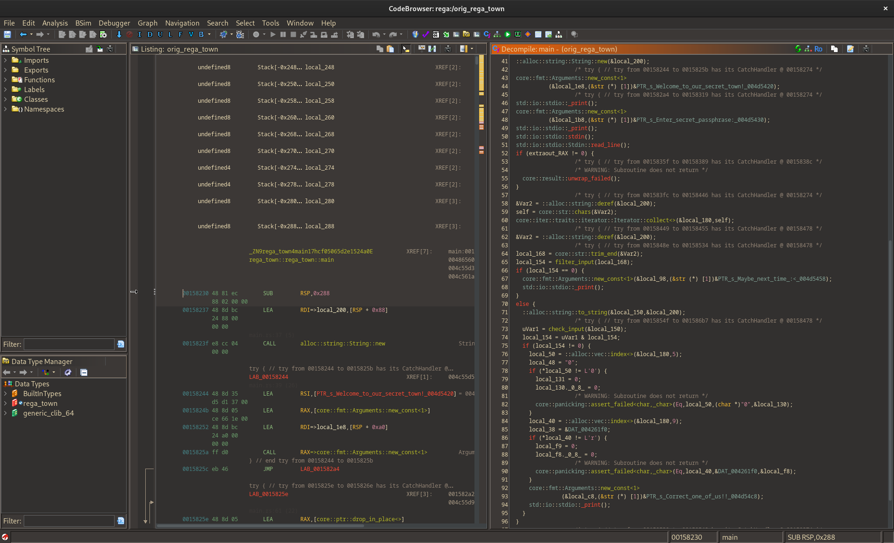
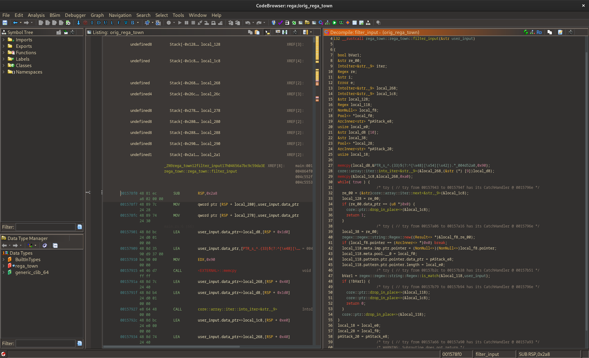
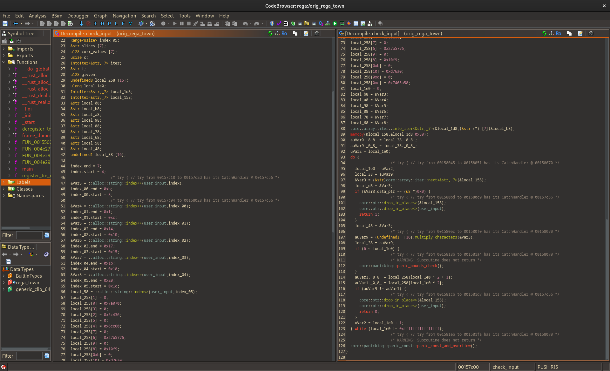

# Write up of HTB CTF Rega's Town
This is a HTB medium-level reversing challenge.

In this CTF we are given the executable rega_town, which when run gives the following output:
```
user@XPS:~/Downloads/HTB/regas/dist$ ./rega_town 
Welcome to our secret town!
Enter secret passphrase:
test
Maybe next time :<
```

Time to fire up Ghidra and see what we're dealing with. Ghidra gives the following decompiled code for the rega_town::main function:


First thing to notice is it's a rust binary, meaning Ghidra struggles with the decompilation especially of the arguments and return values of the called functions. Second thing to note is how even though the decompiled code is a bit misleading it seems fair to assume local_168 is the user input string which is passed to the filter_input function which clearly needs to return non-zero. Lets look closer at that function:

We see what looks like checking the input string against a regex which when not familiar with compiled rust looks like:
```
^.{33}$(?:^[\\x48][\\x54][\\x42]).*^.{3}(\\x7b).*(\\x7d)$^[[:upper:]]{3}.[[:upper:]].{3}[[:upper:]].{3}[[:upper:]].{3}[[:upper:]].{4}[[:upper:]].{2}[[:upper:]].{3}[[:upper:]].{4}$(?:.*\\x5f.*)(?:.[^0-9]*\\d.*){5}.{24}\\x54.\\x65.\\x54.*^.{4}[X-Z]\\d._[A]\\D\\d.................[[:upper:]][n-x]{2}[n|c].$.{11}_T[h|7]\\d_[[:upper:]]\\dn[a-h]_[O]\\d_[[:alpha:]]{3}_.{5}
```
The long regex string confused me, so lets see how it looks during execution:
```
user@XPS:~/Downloads/HTB/regas/clean/dist$ gdb rega_town 
gef➤  b regex::regex::string::Regex::new
gef➤  start
gef➤  c
```
Now GEF shows the following output when reaching the Regex constructor:
```
$rax   : 0x00005555555b4440  →  <regex::regex::string::Regex::new::h893679374b7c876d+0000> sub rsp, 0xe8
$rbx   : 0x00007fffffffde40  →  0x0000555555966b10  →  0x0000000000000001
$rcx   : 0x0               
$rdx   : 0x7               
$rsp   : 0x00007fffffffd730  →  0x00007fffffffd740  →  0x00007fffffffd9d0  →  0x0000000000000038 ("8"?)
$rbp   : 0x00007fffffffdf30  →  0x0000000000000001
$rsi   : 0x000055555587a03b  →  "^.{33}$(?:^[H][T][B]).*^.{3}({).*(})"
$rdi   : 0x00007fffffffd9d0  →  0x0000000000000038 ("8"?)
$rip   : 0x00005555555b4461  →  <regex::regex::string::Regex::new::h893679374b7c876d+0021> lea rax, [rip+0x1388]        # 0x5555555b57f0 <_ZN5regex8builders6string12RegexBuilder3new17h9cef4f88d9616fcaE>
$r8    : 0x0000555555968b60  →  "TESTSTRING\n"
$r9    : 0x0               
$r10   : 0x00005555558c67e6  →   add DWORD PTR [rcx], eax
$r11   : 0x20              
$r12   : 0x38              
$r13   : 0x1               
$r14   : 0x8               
$r15   : 0x0000555555966b20  →  0x0000000000000000
$eflags: [zero carry PARITY adjust sign trap INTERRUPT direction overflow resume virtualx86 identification]
$cs: 0x33 $ss: 0x2b $ds: 0x00 $es: 0x00 $fs: 0x00 $gs: 0x00 
────────────────────────────────────────────────────────────────────────────────────────────────────────────── stack ────
0x00007fffffffd730│+0x0000: 0x00007fffffffd740  →  0x00007fffffffd9d0  →  0x0000000000000038 ("8"?)	 ← $rsp
0x00007fffffffd738│+0x0008: 0x00007fffffffd9d0  →  0x0000000000000038 ("8"?)
0x00007fffffffd740│+0x0010: 0x00007fffffffd9d0  →  0x0000000000000038 ("8"?)
0x00007fffffffd748│+0x0018: 0x0000000000000000
0x00007fffffffd750│+0x0020: 0x00007fffffffd990  →  0x0000000000000001
0x00007fffffffd758│+0x0028: 0x0000000000000001
0x00007fffffffd760│+0x0030: 0x0000000000000000
0x00007fffffffd768│+0x0038: 0x0000000000000000
──────────────────────────────────────────────────────────────────────────────────────────────────────── code:x86:64 ────
   0x5555555b444c <regex::regex::string::Regex::new::h893679374b7c876d+000c> mov    QWORD PTR [rsp+0x8], rdi
   0x5555555b4451 <regex::regex::string::Regex::new::h893679374b7c876d+0011> mov    QWORD PTR [rsp+0xc8], rsi
   0x5555555b4459 <regex::regex::string::Regex::new::h893679374b7c876d+0019> mov    QWORD PTR [rsp+0xd0], rdx
●→ 0x5555555b4461 <regex::regex::string::Regex::new::h893679374b7c876d+0021> lea    rax, [rip+0x1388]        # 0x5555555b57f0 <_ZN5regex8builders6string12RegexBuilder3new17h9cef4f88d9616fcaE>
   0x5555555b4468 <regex::regex::string::Regex::new::h893679374b7c876d+0028> lea    rdi, [rsp+0x20]
   0x5555555b446d <regex::regex::string::Regex::new::h893679374b7c876d+002d> mov    QWORD PTR [rsp+0x18], rdi
   0x5555555b4472 <regex::regex::string::Regex::new::h893679374b7c876d+0032> call   rax
   0x5555555b4474 <regex::regex::string::Regex::new::h893679374b7c876d+0034> mov    rdi, QWORD PTR [rsp+0x10]
   0x5555555b4479 <regex::regex::string::Regex::new::h893679374b7c876d+0039> mov    rsi, QWORD PTR [rsp+0x18]
─────────────────────────────────────────────────────────────────────────────────────────────────────────────────────────
gef➤  
```
From the code section of the above output we see Regex::new takes three arguments in rdi, rsi, and rdx:
```
$rdi   : 0x00007fffffffd9d0  →  0x0000000000000038 ("8"?)
$rsi   : 0x000055555587a03b  →  "^.{33}$(?:^[H][T][B]).*^.{3}({).*(})"
$rdx   : 0x7               
```
GEF derefs the pointers for us, showing the second argument is the long regex string. Apparently rust binaries encodes strings as a pointer and a length, rather than the null-terminated C-strings, thus register rdx looks to hold the length of the string, which seems reasonable since this means the regex for the first iteration is "^.{33}$". This regex simply checks the string is 33 characters long. Now lets give a string that is 33 characters long and see what happens:
```
Welcome to our secret town!
Enter secret passphrase:
AAAAAAAAAAAAAAAAAAAAAAAAAAAAAAAAA
```
Now when continuing at the first call to Regex::new, the binary doesnt exit but rather we get the following register values:
```
────────────────────────────────────────────────────────────────────────────────────────────────────────── registers ────
...
$rdx   : 0x19              
$rsi   : 0x000055555587a042  →  "(?:^[\\x48][\\x54][\\x42]).*^.{3}({).*(})$^[[:up"
$rdi   : 0x00007fffffffd9d0  →  0x000055555596b4f0  →  0x000000055555596b
...
─────────────────────────────────────────────────────────────────────────────────────────────────────────────────────────
gef➤  
```
Great! We passed the first check and are now looking at a different part of the regex. The new regex to pass is `(?:^[H][T][B]).*` which checks our supplied string starts with "HTB". Okay, so solving this part of the binary requires iteratively passing a number of regex checks. Iterating through this process results in the following regexes:
```
^.{33}$
(?:^[\\x48][\\x54][\\x42]).*
^.{3}(\\x7b).*(\\x7d)$
^[[:upper:]]{3}.[[:upper:]].{3}[[:upper:]].{3}[[:upper:]].{3}[[:upper:]].{4}[[:upper:]].{2}[[:upper:]].{3}[[:upper:]].{4}$
(?:.*\\x5f.*)
(?:.[^0-9]*\\d.*){5}
.{24}\\x54.\\x65.\\x54.*
^.{4}[X-Z]\\d._[A]\\D\\d.................[[:upper:]][n-x]{2}[n|c].$
.{11}_T[h|7]\\d_[[:upper:]]\\dn[a-h]_[O]\\d_[[:alpha:]]{3}_.{5}
```
Knowing the regexes, a string which passes all of them can be constructed:
```
HTB{Z0x_AB1_T71_B1nb_O1_Txe_Tnnc}
```
Now the challenge moves on to the check_input function called on line 73 of the decompiled main function:

The multiply_characters function does exactly what you'd expect: it multiplies the ascii values of the characters in the given string. Thus, looking at the whole check_input function, it checks if the product of different substrings equals the constant values set in local_258. The substrings are exactly the words in between the underscores of the string found while passing the regex checks. Thus, a python script can be written to  bruteforce the possible alphanumeric combinations fulfilling the product condition:
```python
import string
import itertools
import re

def check_product(string, target):
    product = 1
    for char in string:
        product *= ord(char)
    return product == target

def check_regex(string, regex):
    return re.fullmatch(regex, string)


alpha_numerics = string.ascii_letters + string.digits

targets = [0x7a070, 0x5c436, 0x6cc60, 0x27b5776, 0x10f9, 0xd76a0, 0x7465a58]
regexes = ["[X-Z]\d.", "[A]\D\d", "T[h|7]\d", "[A-Z]\dn[a-h]", "[O]\d", "T[A-Za-z0-9$]{2}", "[A-Z][n-x]{2}[n|c]"]
lengths = [3,3,3,4,2,3,4]

for target, regex, length in zip(targets, regexes, lengths):
    for t in itertools.product(alpha_numerics, repeat=length):
        if check_product("".join(t), target) and check_regex("".join(t), regex):
            print(t)
    print("_")
```
Running this gives the possible words of the flag:
```
user@XPS:~/Downloads/HTB/regas/dist$ python3 solution.py 
('Y', '0', 'u')
('Y', '4', 'l')
('Y', '6', 'h')
_
('A', 'f', '9')
('A', 'r', '3')
_
('T', 'h', '3')
_
('K', '1', 'n', 'g')
_
('O', '7')
_
('T', 'e', 'h')
('T', 'h', 'e')
_
('T', 'o', 'w', 'n')
('T', 'w', 'o', 'n')
```
Now it could be formally checked which combinations pass the full regex check rather than just the individual checks, but just looking at the few possibilities it is easy to see the full flag:
```
user@XPS:~/Downloads/HTB/regas/dist$ ./rega_town 
Welcome to our secret town!
Enter secret passphrase:
HTB{Y0u_Ar3_Th3_K1ng_O7_The_Town}
Correct one of us!!
```